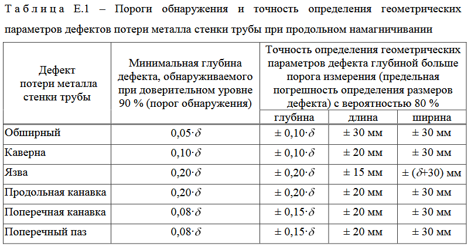
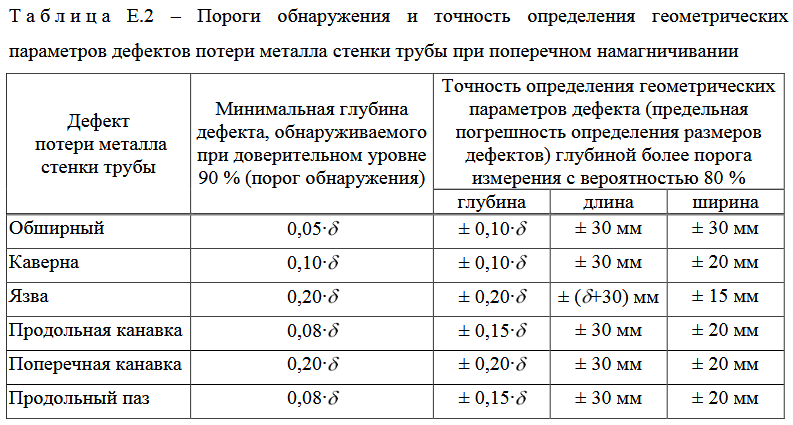

# Модуль Python для проверки точности определения размеров дефектов газопровода
[](https://github.com/vb64/pipeline.anomaly.detection.gazprom/actions?query=workflow%3Apep257)
[](https://github.com/vb64/pipeline.anomaly.detection.gazprom/actions?query=workflow%3Apy2)
[](https://github.com/vb64/pipeline.anomaly.detection.gazprom/actions?query=workflow%3Apy3)
[](https://app.codacy.com/gh/vb64/pipeline.anomaly.detection.gazprom/dashboard?utm_source=gh&utm_medium=referral&utm_content=&utm_campaign=Badge_grade)
[](https://app.codacy.com/gh/vb64/pipeline.anomaly.detection.gazprom/dashboard?utm_source=gh&utm_medium=referral&utm_content=&utm_campaign=Badge_coverage)

Этот модуль Python реализует требования Газпрома к порогу обнаружения и точности определения размеров дефектов трубопровода при продольном и поперечном намагничивании 
согласно "Р Газпром2-2.3-919-2015 ОСНОВНОЕ И ВСПОМОГАТЕЛЬНОЕ ОБОРУДОВАНИЕ ДЛЯ ВНУТРИТРУБНОГО ДИАГНОСТИРОВАНИЯ Технические требования".





## Установка

```bash
pip install pipeline-anomaly-detection-gazprom
```

## Использование

функция `is_detectable` определяет, должен ли выявляться дефект заданных размеров на заданной толщине стенки трубы
при указанном типе намагничивания.

Дефект размером 10x10 мм глубиной 5 мм на стенке трубы толщиной 11 мм должен определяться снарядами с продольным намагничиванием.

```python
from pipeline_anomaly_detection_gazprom import is_detectable, MagnetType

assert is_detectable((10, 10, 5), 11, magnet_type=MagnetType.MFL)
```

функция `is_in_limits` проверяет, укладываются ли в допустимую погрешность вычисленные размеры дефекта по сравнению с его реальными размерами
при заданных толщине стенки трубы и типе намагничивания.

```python
from pipeline_anomaly_detection_gazprom import is_in_limits

# реальные размеры дефекта: длина 90 мм, ширина 12 мм, глубина 4 мм
real = (90, 12, 4)
# вычисленные размеры дефекта: длина 72 мм, ширина 11 мм, глубина 1 мм
calcked = (72, 11, 1)

# проверяем, соответствуют ли вычисленные размеры дефекта допускам, если толщина стенки трубы равна 16.6 мм и тип намагничивания поперечный
length_ok, width_ok, depth_ok = is_in_limits(calcked, real, 16.6, magnet_type=MagnetType.TFI)

# вычисленная длина укладывается в допустимую погрешность
assert length_ok
# вычисленная ширина укладывается в допустимую погрешность
assert width_ok
# вычисленная глубина НЕ укладывается в допустимую погрешность
assert not depth_ok
```

## Разработка

```bash
git clone git@github.com:vb64/pipeline.anomaly.detection.gazprom.git
cd pipeline.anomaly.detection.gazprom
```

При использовании Python 2
```bash
make setup2 PYTHON_BIN=/path/to/python27/executable
make tests2
```

При использовании Python 3
```bash
make setup PYTHON_BIN=/path/to/python37/executable
make tests
```
